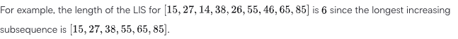
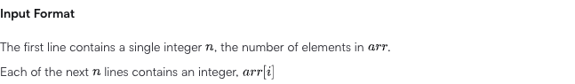
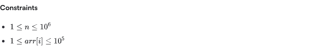
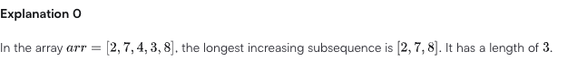
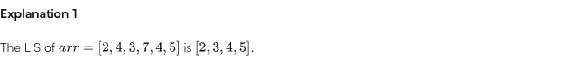

# The Longest Increasing Subsequence

- **HackerRank title:** The Longest Increasing Subsequence
- **Canonical page URL:** https://www.hackerrank.com/challenges/longest-increasing-subsequent/problem

## Statement

### An Introduction to the Longest Increasing Subsequence Problem

The task is to find the length of the longest subsequence in a given array of
integers such that all elements of the subsequence are sorted in strictly
ascending order. This is called the Longest Increasing Subsequence (LIS)
problem.

For example, the length of the LIS for `[15, 27, 14, 38, 26, 55, 46, 65, 85]`
is `6` since the longest increasing subsequence is `[15, 27, 38, 55, 65, 85]`.



There is a lecture from MIT's OpenCourseWare covering the topic, and a more
efficient `O(n log n)` algorithm is described at
[geeksforgeeks.org](http://www.geeksforgeeks.org/construction-of-longest-monotonically-increasing-subsequence-n-log-n/)
(a quadratic-time DP approach is also discussed on the page but does not meet
this problem's constraints — see Algorithm analysis below).

Given a sequence of integers, find the length of its longest strictly
increasing subsequence.

### Function Description

Complete the `longestIncreasingSubsequence` function in the editor below. It
should return an integer that denotes the array's LIS.

`longestIncreasingSubsequence` has the following parameter(s):

- `arr`: an unordered array of integers

### Input Format

The first line contains a single integer `n`, the number of elements in `arr`.
Each of the next `n` lines contains an integer, `arr[i]`.



### Constraints

- `1 <= n <= 10^6`
- `1 <= arr[i] <= 10^5`



### Output Format

Print a single line containing a single integer denoting the length of the
longest increasing subsequence.

### Sample Input 0

```
5
2
7
4
3
8
```

### Sample Output 0

```
3
```

### Explanation 0

In the array `arr = [2, 7, 4, 3, 8]`, the longest increasing subsequence is
`[2, 7, 8]`. It has a length of `3`.



### Sample Input 1

```
6
2
4
3
7
4
5
```

### Sample Output 1

```
4
```

### Explanation 1

The LIS of `arr = [2, 4, 3, 7, 4, 5]` is `[2, 3, 4, 5]`.



## Java version

- **User-chosen Java release:** Java 15
- **Selected HackerRank label:** Java 15
- **Resolution source:** user

### Starter code (Java 15, as loaded in the HackerRank editor)

```java
import java.io.*;
import java.math.*;
import java.security.*;
import java.text.*;
import java.util.*;
import java.util.concurrent.*;
import java.util.function.*;
import java.util.regex.*;
import java.util.stream.*;
import static java.util.stream.Collectors.joining;
import static java.util.stream.Collectors.toList;

class Result {

    /*
     * Complete the 'longestIncreasingSubsequence' function below.
     *
     * The function is expected to return an INTEGER.
     * The function accepts INTEGER_ARRAY arr as parameter.
     */

    public static int longestIncreasingSubsequence(List<Integer> arr) {
    // Write your code here

    }

}

public class Solution {
    static void main(String[] args) throws IOException {
        BufferedReader bufferedReader = new BufferedReader(new InputStreamReader(System.in));
        BufferedWriter bufferedWriter = new BufferedWriter(new FileWriter(System.getenv("OUTPUT_PATH")));

        int n = Integer.parseInt(bufferedReader.readLine().trim());

        List<Integer> arr = IntStream.range(0, n).mapToObj(i -> {
            try {
                return bufferedReader.readLine().replaceAll("\\s+$", "");
            } catch (IOException ex) {
                throw new RuntimeException(ex);
            }
        })
            .map(String::trim)
            .map(Integer::parseInt)
            .toList();

        int result = Result.longestIncreasingSubsequence(arr);

        bufferedWriter.write(String.valueOf(result));
        bufferedWriter.newLine();

        bufferedReader.close();
        bufferedWriter.close();
    }
}
```

## Required signature and observable behavior

- Required method: `public static int longestIncreasingSubsequence(List<Integer> arr)` on class `Result`.
- Input: a `List<Integer>` of `n` elements, `1 <= n <= 10^6`, each `1 <= arr[i] <= 10^5`.
- Output: an `int`, the length of the longest strictly increasing subsequence of `arr`.
- The HackerRank driver (`Solution.main`) reads `n` then `n` integers (one per
  line) from stdin, calls `Result.longestIncreasingSubsequence`, and writes the
  single integer result followed by a newline to the output path. This driver
  must not be altered.

## Algorithm analysis

**Constraint-driven choice.** `n` up to `10^6` rules out the classic
`O(n^2)` DP (`dp[i]` = LIS ending at `i`): worst case is `10^12` comparisons,
far beyond a feasible time budget. The problem statement itself points at the
`O(n log n)` "patience sorting" style algorithm, which is required here.

**Approach — patience sorting with binary search (`O(n log n)` time, `O(n)` auxiliary space).**

Maintain a list `tails` where `tails[k]` holds the smallest possible tail value
of any strictly increasing subsequence of length `k + 1` found so far among the
elements processed. For each incoming value `x`:

- Binary search `tails` for the leftmost index `i` such that `tails[i] >= x`
  (lower bound).
- If no such index exists (`x` is greater than every value in `tails`),
  append `x` — it extends the longest subsequence found so far.
- Otherwise replace `tails[i] = x` — `x` gives a strictly smaller tail for a
  subsequence of that same length, which can only help extend it more easily
  later, without changing the recorded subsequence *length*.

The final length of `tails` is the LIS length. Strict monotonicity is enforced
by using a lower bound (`>=`) rather than an upper bound, so equal values
never extend the subsequence (matches "strictly ascending").

**Invariants**

- `tails` is always sorted in strictly ascending order.
- `tails.length` after processing a prefix of `arr` equals the LIS length of
  that prefix.
- `tails[k]` is always the minimum possible tail value among all strictly
  increasing subsequences of length `k + 1` seen so far, which is what makes
  greedily replacing it correct (it never removes a valid extension
  opportunity).

**Edge cases**

- `n == 1`: answer is `1`.
- Strictly decreasing array: answer is `1` (every replacement lands at index 0).
- Strictly increasing array: `tails` grows by one every step; answer is `n`.
- Duplicate values: duplicates never extend `tails` (lower-bound / `>=`
  replacement), correctly enforcing strict ascending order.
- All elements equal: answer is `1`.

**Complexity**

- Time: `O(n log n)` — one binary search (`O(log n)`) per element, `n`
  elements.
- Auxiliary space: `O(n)` — the `tails` list can grow up to `n` elements in
  the worst case (fully increasing input); the input list itself is `O(n)`
  and is not duplicated.

No unreadable, ambiguous, or conflicting source material was encountered on
the page.
